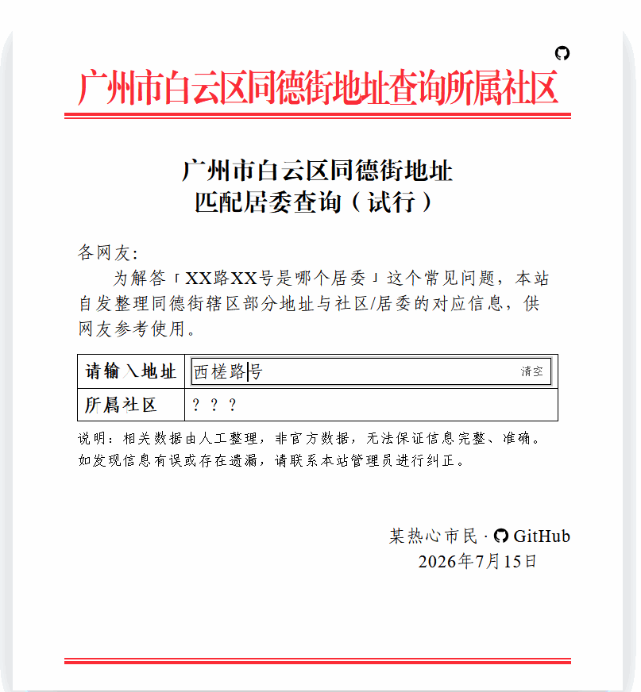

# 自动化分居委

基于 TypeScript 的地址匹配社区（居委）工具。



仓库为 Monorepo，包含：

- 核心库（`packages/core`）
- Excel 批处理 CLI（`packages/cli`）
- Web 查询页面（`apps/web`，Astro + Svelte）

## 仓库结构

```text
apps/
	web/              # Web 查询页面（Astro + Svelte）
packages/
	core/             # 地址 -> 社区 匹配核心逻辑
	cli/              # Excel 批处理与辅助脚本
```

## 环境要求

- Node.js >= 24.12.0
- Bun >= 1.3.14

## 安装依赖

```bash
bun install
```

## 快速开始

### 1) Web 查询页面

Demo: [https://tdjw.chenxing.dev](https://tdjw.chenxing.dev)

### 2) Excel 批量分居委（CLI）

在仓库根目录执行：

```bash
bun packages/cli/index.ts <企业名单.xlsx> [选项]
```

## 作为核心库使用

可直接复用核心匹配函数 `匹配所属社区()`：

```ts
import { 匹配所属社区 } from "./packages/core/resolver";

const 社区 = 匹配所属社区("广州市白云区西槎路31号");
console.log(社区);
```

## 其他命令

```bash
# Compile core 包
bun run build

# 代码检查
bun run lint

# 代码格式化
bun run format
```

## 数据与准确性说明

- 仅支持 `.xlsx` 文件
- 表头会自动识别（如“所属街道/镇街/注册地址”等）
- 匹配规则基于街道名、门牌号区间与单双号
- 数据为人工整理，可能存在遗漏或误差
